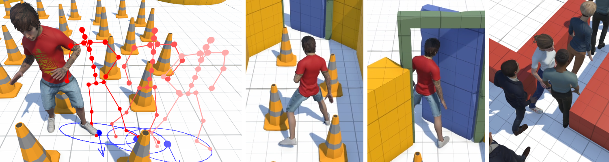
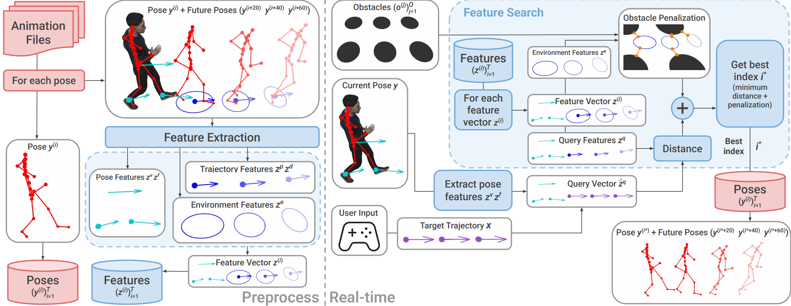

<div align="center">

# Environment-aware Motion Matching <br> SIGGRAPH Asia 2025

[Jose Luis Ponton](https://joseluisponton.com/)^1, [Sheldon Andrews](https://profs.etsmtl.ca/sandrews/)^2, [Carlos Andujar](https://www.cs.upc.edu/~virtual/home/index.html)^1, [Nuria Pelechano](https://www.cs.upc.edu/~npelechano/)^1

^1 [Universitat Politècnica de Catalunya (UPC)](https://www.upc.edu/en)  
^2 [École de technologie supérieure (ÉTS Montréal)](https://www.etsmtl.ca/)

[Project page](https://upc-virvig.github.io/Environment-aware-Motion-Matching/) | [Paper (ACM DL)](https://doi.org/10.1145/3763334) | [Video](https://youtu.be/u8LISEkGsyk) | [Data (Zenodo)](https://zenodo.org/records/17220516)



</div>

## Overview

Environment-aware Motion Matching (EMM) is a real-time system for full‑body character animation that adapts motion to the surrounding environment, obstacles, and nearby agents. It extends Motion Matching with environment features and obstacle-aware penalization during the search, emphasizing the bidirectional relationship between pose and trajectory.

This repository contains the Unity project used in the paper presented at SIGGRAPH Asia 2025.



## Quick start (Unity)

> [!NOTE] 
> Tested with Unity 6.2 (Editor version 6000.2.7f2). Other versions may work.

1) Install Unity: https://unity.com/download

2) Clone this repository.

3) Open Unity Hub → Add project from disk → select the `Unity` folder in this repo.

4) Let Unity resolve dependencies automatically. If there is any issue with the MotionMatching package (our core package), install it manually following the instructions here: https://github.com/JLPM22/MotionMatching

5) Import the Motion Matching examples used by this project:
	 - Unity Editor → Window → Package Manager.
	 - In the In Project list, select Motion Matching.
	 - On the right panel, open Samples and click Import on the sample named “Examples”.

6) Open a scene from `Unity/Assets/EnvironmentMotionMatching/Scenes` and press Play.

## Scenes

Scenes are under `Unity/Assets/EnvironmentMotionMatching/Scenes`:

- EMM_NoDependencies
	- Works out of the box without third‑party assets.

- EMM_PolygonAssets
	- Uses third‑party low‑poly assets for the environments, as shown in figures/videos. If you own these packages, import them and re-open the scenes:
		- [POLYGON Prototype](https://assetstore.unity.com/packages/essentials/tutorial-projects/polygon-prototype-low-poly-3d-art-by-synty-137126) (used in most scenes)
		- [POLYGON City](https://assetstore.unity.com/packages/3d/environments/urban/polygon-city-low-poly-3d-art-by-synty-95214) (crowd/multi-agent scenes)
		- [POLYGON Office](https://assetstore.unity.com/packages/3d/props/interior/polygon-office-low-poly-3d-art-by-synty-159492) (only used in the box scene)
		- [POLYGON Heist](https://assetstore.unity.com/packages/3d/environments/urban/polygon-heist-low-poly-3d-art-by-synty-97949) (only used in the weapon scene)

## Data

- All data needed to run the scenes is already included in the Unity project under `Assets/EnvironmentMotionMatching/Animations` and generated StreamingAssets.
- Optionally, you can download the original motion data as BVH from [Zenodo](https://zenodo.org/records/17220516)

## Folder structure (under `Unity/Assets/EnvironmentMotionMatching`)

- Animations
	- Contains BVH files and MMData assets that define features and databases. See docs of the core package: https://jlpm22.github.io/motionmatching-docs/

- Assets
	- Materials and rigged models using our Xsens skeleton. Prefabs are for POLYGON assets and can be ignored if you don’t use those packs.

- Scenes
	- Example scenes for EMM (see section above).

- Scripts
	- Auxiliary scripts extending the core Motion Matching package.
	- CustomFeatureExtractors: custom features used by EMM, including
		- `EllipseFeatureExtractor.cs`
		- `HeightFeatureExtractor.cs`
		See: https://jlpm22.github.io/motionmatching-docs/advanced/custom_features/
	- MotionMatchingSearch: custom search implementations with obstacle penalizations and Burst optimizations.
		See: https://jlpm22.github.io/motionmatching-docs/advanced/custom_search/

- Search
	- ScriptableObjects defining parameters for the custom searches. Assign these to each character’s `MotionMatchingController`.
	- Tip: for performance, set MinimumStepSize = 8.

## How it works (very short)

- Preprocessing extracts pose, trajectory, and environment features from motion capture data to build databases.
- At runtime, a query vector (from input and current pose) is matched to database entries. Environment features compute dynamic obstacle penalizations that guide the search.
- We build on the Motion Matching workflow and add environment-aware features and scoring.

## Core Motion Matching package (dependency)

This project relies on our reusable Motion Matching package for Unity. If you want to learn more, use it in your projects, or import additional samples, visit the main repository:

- Motion Matching for Unity: https://github.com/JLPM22/MotionMatching
- Documentation: https://jlpm22.github.io/motionmatching-docs/

The package README includes a quick start, example scenes, and background material. It’s also a good resource if you want to implement custom features or searches.

## Troubleshooting

- Package resolution errors after opening the project:
	- Open Package Manager and ensure the Motion Matching package is present. If needed, add it by Git URL as described in the core repo.

- Missing example scripts:
	- Import the Motion Matching “Examples” sample via Package Manager (see Quick start step 5).

- Scenes with missing environment meshes or materials:
	- Import the listed POLYGON asset packs if you plan to use the EMM_PolygonAssets scenes.

## Citation

If you use this project, please cite the SIGGRAPH Asia 2025 paper:

```bibtex
@article{2025:ponton:emm,
	author = {Ponton, Jose Luis and Andrews, Sheldon and Andujar, Carlos and Pelechano, Nuria},
	title = {Environment-aware Motion Matching},
	year = {2025},
	publisher = {Association for Computing Machinery},
	booktitle = {SIGGRAPH Asia 2025},
	address = {New York, NY, USA},
	issn = {0730-0301},
	doi = {10.1145/3763334},
	journal = {ACM Trans. Graph.},
}
```

For background on the underlying Motion Matching package, see the author’s thesis:

```bibtex
@mastersthesis{ponton2022mm,
	author  = {Ponton, Jose Luis},
	title   = {Motion Matching for Character Animation and Virtual Reality Avatars in Unity},
	school  = {Universitat Politecnica de Catalunya},
	year    = {2022},
	doi     = {10.13140/RG.2.2.31741.23528/1}
}
```

## License

This project is released under the MIT License. See `LICENSE` for details.

